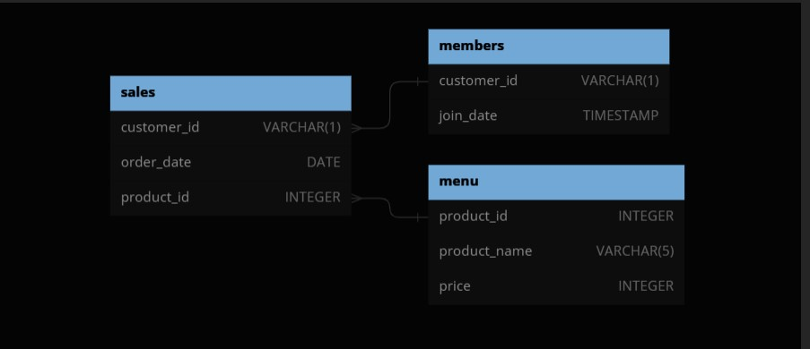
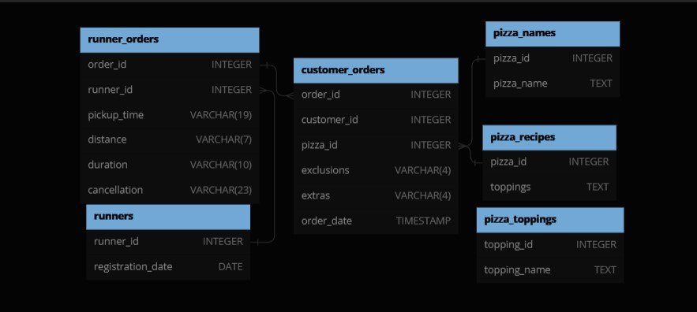
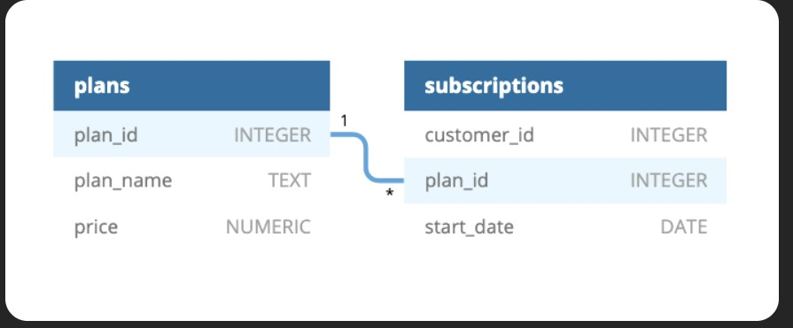
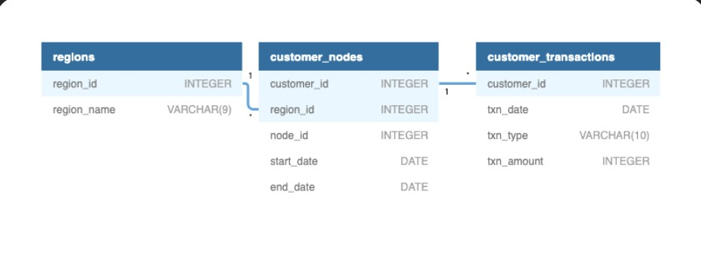

# 8WeekSQLChallenge
This repository contains solutions to Danny Ma's 8 week challenge. This challenge tests the understanding of sql data manipulation and also the application of sql to solve real world problems.
Tech stack: MySQL

## Table of Contents 

- [Case Study 1](#case-study-1)
- [Case Study 2](#case-study-2)
- [Case Study 3](#case-study-3)
- [Case Study 4](#case-study-4)

## Case Study 1:
## [Danny's Diner](https://8weeksqlchallenge.com/case-study-1/)
### Entity Relationship Diagram (ERD)

 
[Solution](https://github.com/OmarCypha700/8WeekSQLChallenge/blob/main/WEEK%201%3A%20Danny's%20Diner.md)

## Case Study 2:
## [Pizza Runner](https://8weeksqlchallenge.com/case-study-2/)
### Entity Relationship Diagram (ERD)

 
[Solution](https://github.com/OmarCypha700/8WeekSQLChallenge/blob/main/Week%202%3A%20Pizza%20Runner.md)

## Case Study 3:
## [Foodie_Fi](https://8weeksqlchallenge.com/case-study-3/)
### Entity Relationship Diagram (ERD)

 
[Solution](https://github.com/OmarCypha700/8WeekSQLChallenge/blob/main/WEEK%203%3A%20Foodie_FI.md)

## Case Study 4:
## [Data Bank](https://8weeksqlchallenge.com/case-study-3/)
### Entity Relationship Diagram (ERD)

 
[Solution](https://github.com/OmarCypha700/8WeekSQLChallenge/blob/main/WEEK%204%3A%20Data%20Bank.md)

