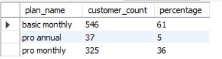

# WEEK 3: Foodie_Fi 🍴

## Table of Contents
- [Customer Journey](#a-customer-journey)
- [Data Analysis Questions](#b-data-analysis-questions)
- [Challenge Payment Questions](#c-challenge-payment-questions)
- [Outside The Box Questions](#d-outside-the-box-questions)

## A. Customer Journey

#### 1. Based off the 8 sample customers provided in the sample from the subscriptions table, write a brief description about each customer’s onboarding journey.

- <code> customer_id 1 </code> signed up to the 7 days free trial on 2020-08-01, and downgraded to the basic monthly plan after one week.
- <code> customer_id 2 </code> signed up to the 7 days free trial on 2020-09-20, and upgraded to the pro annual plan after the free trial.
- <code> customer_id 11 </code> jumped on the 7 days free trial on 2020-11-19, and canceled thier foodie_fi service after a week.
- <code> customer_id 13 </code> signed up to the 7 free trial on 2020-12-15, and upgraded to the basic monthly plan after one week and further upgraded to the pro monthly plan a week after.
- <code> customer_id 15 </code> joined the 7 days free trial on 2020-03-17, and upgraded to pro monthly plan after a week and then cancelled his foodie_fi service after a month and some days.
- <code> customer_id 16 </code> joined the 7 days free trial on 2020-05-31, upgraded to the basic monthly plan after one week and to the pro anual plan after over 4 months
- <code> customer_id 18 </code> jumped on the 7 days free trial on 2020-07-06, and upgraded to the pro monthly plan a week after.
- <code> customer_id 19 </code> signed up to the 7 days free trial on 2020-06-22, and upgraded to the pro monthly plan after a week, and to the pro annual plan after two months

## B. Data Analysis Questions

##### How many customers has Foodie-Fi ever had?

```sql
SELECT COUNT(DISTINCT customer_id) AS customers_count
FROM foodie_fi.subscriptions;
```


##### What is the monthly distribution of trial plan start_date values for our dataset - use the start of the month as the group by value

```sql
SELECT MONTHNAME(start_date) AS month, COUNT(customer_id) AS num_trial_customers
FROM foodie_fi.subscriptions
WHERE plan_id = 0
GROUP BY month;
```


##### What plan start_date values occur after the year 2020 for our dataset? Show the breakdown by count of events for each plan_name

```sql
SELECT p.plan_name, COUNT(start_date) AS start_dates_after_2020
FROM foodie_fi.subscriptions AS s
JOIN plans AS p USING (plan_id)
WHERE start_date > '2020-12-31'
GROUP BY p.plan_name
ORDER BY start_dates_after_2020;
```


##### What is the customer count and percentage of customers who have churned rounded to 1 decimal place?

```sql
WITH customers AS (
	SELECT COUNT(DISTINCT customer_id) AS customer_count
   FROM foodie_fi.subscriptions
),
churned AS (
	SELECT COUNT(s.customer_id) AS churned_customers
	FROM foodie_fi.subscriptions AS s
	WHERE plan_id = 4
)
SELECT customers.customer_count, 
	     churned.churned_customers, 
       ROUND((churned.churned_customers / customers.customer_count) * 100, 1) AS percentage_churned
FROM customers, churned;
```


##### How many customers have churned straight after their initial free trial - what percentage is this rounded to the nearest whole number?

```sql
WITH trial AS (
SELECT *
FROM foodie_fi.subscriptions
WHERE plan_id = 0
),
churned AS (
SELECT *
FROM foodie_fi.subscriptions
WHERE plan_id = 4
)
SELECT COUNT(c.customer_id) AS churned_after_trial,
-- 'COUNT(c.customer_id)' is divided by 1000 because the number of unique customers is 1000 
-- as found in the first question of Section B above
	   CEIL((COUNT(c.customer_id) / 1000) * 100) AS percentage
FROM churned AS c
JOIN trial AS t
USING (customer_id)
WHERE c.start_date = t.start_date + INTERVAL 7 DAY;
```


##### What is the number and percentage of customer plans after their initial free trial?

```sql
WITH trial AS (
SELECT *
FROM foodie_fi.subscriptions
WHERE plan_id = 0
),
plans AS (
SELECT *
FROM foodie_fi.subscriptions
WHERE plan_id != 0 
AND plan_id != 4
)
SELECT pn.plan_name, 
	   COUNT(p.customer_id) AS customer_count,
-- '(COUNT(p.customer_id)' because it was the total value from adding all values displayed
-- you can also get the total value by quering '(COUNT(p.customer_id)' without the 'GROUP BY'
       CEIL((COUNT(p.customer_id) / 908) * 100) AS percentage
FROM plans AS p
JOIN trial AS t
USING (customer_id)
JOIN foodie_fi.plans AS pn
ON P.plan_id = pn.plan_id
WHERE p.start_date = t.start_date + INTERVAL 7 DAY
GROUP BY pn.plan_name;
```


##### What is the customer count and percentage breakdown of all 5 plan_name values at 2020-12-31?

```sql
SELECT p.plan_name, 
	     COUNT(DISTINCT s.customer_id) customer_count,
	     CEIL((COUNT(DISTINCT s.customer_id) / 1) * 100) AS percentage
FROM foodie_fi.subscriptions AS s
JOIN foodie_fi.plans AS p
USING (plan_id)
WHERE start_date = '2020-12-31'
GROUP BY p.plan_name;
```


##### How many customers have upgraded to an annual plan in 2020?

```sql
SELECT COUNT(*) AS annual_plan_count
FROM foodie_fi.subscriptions
WHERE plan_id = 3
AND YEAR(start_date) = 2020;
```


##### How many days on average does it take for a customer to an annual plan from the day they join Foodie-Fi?

```sql
WITH trial AS (
SELECT *
FROM foodie_fi.subscriptions
WHERE plan_id = 0
),
annual AS (
SELECT *
FROM foodie_fi.subscriptions
WHERE plan_id = 3
)
SELECT AVG(DAY(a.start_date - t.start_date)) as avg_days
FROM annual AS a
JOIN trial AS t
USING (customer_id);
```


##### How many customers downgraded from a pro monthly to a basic monthly plan in 2020?

```sql
WITH basic_monthly AS (
SELECT *
FROM foodie_fi.subscriptions
WHERE plan_id = 1
),
pro_monthly AS (
SELECT *
FROM foodie_fi.subscriptions
WHERE plan_id = 2
)
SELECT COUNT(*) AS customer_count
FROM basic_monthly AS bm
JOIN pro_monthly AS pm
USING (customer_id)
WHERE bm.start_date > pm.start_date
AND YEAR(bm.start_date) = 2020
AND YEAR(pm.start_date) = 2020;
```


## C. Challenge Payment Questions

##### The Foodie-Fi team wants you to create a new payments table for the year 2020 that includes amounts paid by each customer in the subscriptions table with the following requirements:
- monthly payments always occur on the same day of month as the original start_date of any monthly paid plan
- upgrades from basic to monthly or pro plans are reduced by the current paid amount in that month and start immediately
- upgrades from pro monthly to pro annual are paid at the end of the current billing period and also starts at the end of the month period
- once a customer churns they will no longer make payments

```sql
DROP TABLE IF EXISTS payments_2020;

CREATE TABLE payments_2020
SELECT s.customer_id,
	   s.plan_id,
       p.plan_name,
       s.start_date,
       p.price,
       ROW_NUMBER() OVER (PARTITION BY s.customer_id ORDER BY s.customer_id ) AS payment_order
FROM foodie_fi.subscriptions AS s
JOIN foodie_fi.plans AS p
USING (plan_id)
WHERE plan_id != 0
AND plan_id != 4
AND s.start_date LIKE '2020%';

SELECT *
FROM foodie_fi.payments_2020;
```


## D. Outside The Box Questions

The following are open ended questions which might be asked during a technical interview for this case study - there are no right or wrong answers, but answers that make sense from both a technical and a business perspective make an amazing impression!

#### How would you calculate the rate of growth for Foodie-Fi?

To calculate the rate of growth for Foodie-Fi, you would need data on the number of customers or revenue over a specific period of time. 
The formula for calculating the growth rate is as follows:
</br>
<code> Growth Rate = ((Present Value - Past Value) / Past Value) * 100 </code>

- To do this I created another table <code> payments </code> which is prety much the same as <code> payments_2020 </code> table from Section C. 
This table however, does not specify a particular year

```sql
DROP TABLE IF EXISTS payments;

CREATE TABLE payments
SELECT s.customer_id,
	   s.plan_id,
       p.plan_name,
       s.start_date,
       p.price,
       ROW_NUMBER() OVER (PARTITION BY s.customer_id ORDER BY s.customer_id ) AS payment_order
FROM foodie_fi.subscriptions AS s
JOIN foodie_fi.plans AS p
USING (plan_id)
WHERE plan_id != 0
AND plan_id != 4;
```

- Growth rate in terms of customers who subscribed to a plan after the 7 days trial

```sql
SELECT
  ROUND(((total_customers_2021 - total_customers_2020) / total_customers_2020) * 100, 1) AS growth_rate
FROM
  (SELECT
  -- total number of customers who subscribed to a plan after the trial in 2021
	(SELECT COUNT(DISTINCT customer_id) 
	FROM foodie_fi.payments 
	WHERE YEAR(start_date) = 2021
	)AS total_customers_2021,
-- total number of customers who subscribed to a plan after the trial in 2020
    (SELECT COUNT(DISTINCT customer_id) 
	FROM foodie_fi.payments 
	WHERE YEAR(start_date) = 2020
	) AS total_customers_2020
  ) AS subquery;
```


A growth rate of -85.9% indicates a severe decline in the number of individuals subscribing to a payment plan after the 7 days free trial in 2021 as compared to 2020,
highlighting the need for immediate attention and corrective measures to reverse the negative trend and restore growth.

- Growth rate could also be calculated in terms of revenue

```sql
SELECT
  ROUND(((total_price_2021 - total_price_2020) / total_price_2020) * 100, 1) AS growth_rate
FROM
  (SELECT
  -- total revenue accumulated in 2021
    (SELECT SUM(price) FROM foodie_fi.payments WHERE YEAR(start_date) = 2021) AS total_price_2021,
-- total revenue accumulated in 2020
    (SELECT SUM(price) FROM foodie_fi.payments WHERE YEAR(start_date) = 2020) AS total_price_2020
  ) AS subquery;
``` 


A growth rate of -74.3% indicates a sharp decline in foodie_fi's revenue compared to the previous period (2020)

### What key metrics would you recommend Foodie-Fi management to track over time to assess performance of their overall business?

#### Revenue: 
Monitoring the total revenue generated by Foodie-Fi on a regular basis. This may include subscription fees, advertising revenue, and any other sources of income. Tracking revenue will help assess the financial health and growth of the business.
#### Customer Acquisition and Churn: 
Keeping track of the number of new customers acquired during a specific period and the rate at which customers are leaving (churn rate). This will help evaluate the effectiveness of marketing and customer retention strategies.
#### Customer Satisfaction: 
Regularly measuring customer satisfaction through surveys, feedback, or ratings. Understanding customer satisfaction levels helps measure the overall quality of the service and identify areas for improvement.

